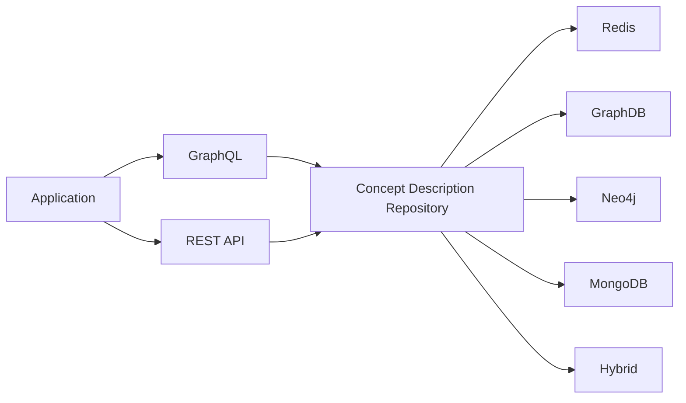

# AAS Brain Concept Description Repository

[](https://opensource.org/licenses/MIT) [](https://hub.docker.com/r/mhrimaz/aas-brain-concept-description-repo)
 [](https://github.com/tophat/getting-started/blob/master/scorecard.md) [](https://github.com/psf/black) [](https://sonarcloud.io/summary/new_code?id=mhrimaz_aasbrain-concept-description-repo) [](https://sonarcloud.io/summary/new_code?id=mhrimaz_aasbrain-concept-description-repo) 


AAS Brain features solutions and tries to overcome existing limitations and propose alternative approaches to deal with Asset Administration Shell. An attempt to make the AAS interaction better. 

**AAS is great, but let's make it even better**

- You need to create a lot of Concept Descriptions at the same time or get multiple Concept Descriptions in one call? Use the Bulk API

- REST API interaction doesn't fit for your client side that only needs the unit symbol? Simply avoid overfetching and underfetching by using our GraphQL endpoint. 

- What is the relationship between concepts? Can I have a clustered view? Can I use my industrial Ontology? Our semantic backend is just for that, contact us!

- I don't need an API, I need a user interface. Do you have something like that? We have, contact us!


## Usage

**NOTE: Docker commands and documentations will be provided.**

```bash
docker pull mhrimaz/aas-brain-concept-description-repo
```

Simple deployment:
```bash
docker run --name=cd-redis -p6767:6379 redis:7.0-alpine
docker run -e DB_URI="redis://cd-redis:6379" --link=cd-redis -p9393:80 mhrimaz/aas-brain-concept-description-repo
```

### RestAPI and beyond

Swagger UI documentation is available on `/docs` endpoint. All inputs are validated, so you will be sure everything getting in is valid! Moreover, we have non-normative APIs for bulk requests, better search, and history change tracking. You can disable these extra features if you want.


### GraphQL

Don't mix GraphQL with GQL (Graph Query Language). GraphQL is not a query language like SPARQL, Cypher, SQL, .. it is rather a query language for the shape of data. By defining a GraphQL schema, client can ask for what they need. Do you need to show only the unit to the user? Then you don't need other fields, you can simply request for that specific part. GraphQL exactly created to solve this problem. GraphiQL interface for interactive queries is accessible at `/graphql` endpoint.


If you want to show the value of a property and its unit, you need to get the whole concept description, for the example here the complete response size is 1000B.


But with GraphQL you can ask only what you need, and you will get only what you requested for. The response size is now only 239B. Small difference for sure, but if you want to fetch milions of concepts in such a way, the difference will add up!


### Backends


**Which backend is the best?**

Which backend is the best? The answer is obvious! It depends :)

- Semantic workloads: AAS Brain is the only repository that offers RDF and a semantic backend using Ontotext GraphDB (Free/Enterprise). By leveraging RDF model, which is part of the specification, you will not only have AAS in a knowledge graph, but you can further utilize SPARQL as a query language, SHACL for data quality assurance, and offer semantic reasoning. AAS Brain full profile offers such capabilities. If you are interested to know about its semantic capabilities, feel free to contact.

- Fastest retrival by ID: Redis is mostly suitable for fast retrival use cases when you already know the ID of Concept Description and you don't want to actually query the content of Concept Description.
In this type of workload Redis is the fastest. Unlike other in-memory alternatives, we don't use runtime environment heap space which is only suitable for testing purposes. Redis offers a horizontally scalable in-memory solution.

- Huge read/write: MongoDB is a scalable solution for heavy read and write applications. Similar to Eclipse BaSyx, we also have MongoDB backend. It is mostly suitable for a general workloads.

- GraphQL optimized with search capability: Thanks to the AAS-Connect master schema, and Neo4j GraphQL library, a graphql endpoint is at its most optimum way. Moreover, Neo4j automatically generates query parameters so you have much more flexibility here. So if you want to have GraphQL consider to use Neo4j backend.

- Hybrid: Thanks to our Redis-based in-memory solution, in future, you can leverage Redis as a caching layer for frequently accessed resources. This is a future plan.

### Built-in UI

With the built-in user interface, you can see all concepts, search for them, edit them, and create or delete them. This is not a priority for now, but we will implement it.


## Licence

You are allowed to do whatever you want, just make the AAS great!

## Contributions

Any feedback, discussion, issue, ... are welcomed.


Code Quality provided by SonarCloud:

[](https://sonarcloud.io/summary/new_code?id=mhrimaz_aasbrain-concept-description-repo) 
